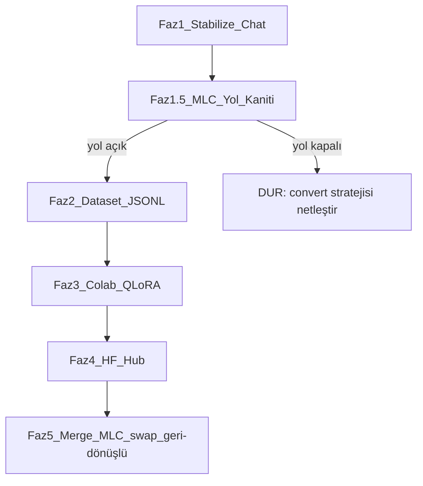

# Stabilize → Yol Kanıtı → Dataset → Colab LoRA → HF → MLC (v2)

Demo Day / jüri anlatısı **yok**. Zaman baskısı yok. Hedef: çalışan, anlamlı
cevap veren chat + gerçek fine-tune entegrasyonu. Acele yok, doğru yapılacak.

## v1'den farklar (neden değişti)

| # | Değişiklik | Neden |
|---|-----------|-------|
| 1 | **Yeni Faz 1.5: MLC yükleme yolu kanıtı** — eğitimden ÖNCE | v1 eğitimi (Faz 3) yükleme kanıtından (Faz 5) önce yapıyordu. Colab'da 3-5 saat eğitip sonunda MLC'ye bağlayamama riski. Windows native MLC KIRIK olduğu kanıtlandı (`DataflowVar name_hint`) — convert/compile yolunun nerede çalışacağı belirsiz. Bunu eğitimden önce çöz. |
| 2 | **Gated erişim adımı öne alındı** | `google/gemma-2b-it` HF'de gated. Onay saatler-günler sürebilir. Faz 3'te fark edersen beklersin; şimdi başvur. |
| 3 | **MLC convert nerede yapılacak netleşti** | v1 "ayrı makine/Colab veya local" diye muğlak bırakmış. Windows local kırık → convert Colab/Linux'ta yapılacak, net. |
| 4 | **Geri dönüş güvenliği** | v1 Faz 5 modeli kalıcı değiştiriyor. Mevcut çalışan 2B'yi koruyacak yedek/rollback adımı eklendi. |
| 5 | **base model tutarlılığı doğrulaması** | Docker MLC `gemma-2b-it` (v1'de var) ama son oturumlarda `/app/model` = Gemma 2B çalışıyordu. Eğitilen base ile serve edilen base AYNI olmalı yoksa adapter uymaz. Faz 1.5'te doğrulanacak. |

**Sabit kararlar (değişmedi)**
- Inference base: Docker MLC Gemma 2B CPU. Image rastgele rebuild yok.
- Eğitim: Google Colab (ücretsiz T4), base `google/gemma-2b-it` + PEFT QLoRA.
- Adapter yolu: eğitilmiş LoRA'yı base'e merge → yeni MLC artifact. Soft PEFT swap geriye uyumlu kalır.
- Dataset sende yok → repo'ya JSONL şablon, sen dolduracaksın (~100-300 satır Türkçe).



---

## Faz 1 — Chat'i gerçekten ayağa kaldır (öncelik)

**Başarı kriteri:** `localhost:3002/chat` üzerinden en az 3 basit Türkçe soruya
kısa, Türkçe, makul doğru cevap ("Türkiye'nin başkenti?" → **Ankara**, "2+2?" → 4,
"Bu proje ne yapıyor?"). Yavaşlık (1-3 dk TTFT) kabul; **yanlış/halüsinasyon kabul değil.**

> Son ölçümde 2B "Abuja" dedi. Bu fazın asıl işi bunu düzeltmek — çünkü
> fine-tune ancak base makul çalışıyorsa üstüne bir şey katar. Base tamamen
> saçmalıyorsa sorun sadece eğitimle değil, prompt/config'le de ilgilidir.

1. **Ops smoke:** Docker Desktop → `scripts/demo-up.ps1` → `:8080/healthz` ready → frontend :3002
2. **Modeli izole et:** Frontend'i baypas et, gateway'e minimal curl (tek user
   mesajı, `max_tokens: 64`, `temperature: 0.2`, system prompt YOK). Ham model
   ne diyor? "Abuja" ham modelden mi geliyor yoksa prompt katmanı mı bozuyor?
   ```powershell
   $b = '{"model":"/app/model","messages":[{"role":"user","content":"Türkiye''nin başkenti neresidir? Tek kelime."}],"max_tokens":32,"temperature":0.2,"stream":false}'
   curl.exe -s -m 200 http://localhost:8080/v1/chat/completions -X POST -H "Content-Type: application/json" -d $b
   ```
   - Ham model doğru (Ankara) → sorun prompt katmanı (`webmcp.ts` / gateway trim)
   - Ham model de yanlış (Abuja) → base model + sampling sorunu; temperature
     düşür (0.1), repetition_penalty ekle, veya bu base'in Türkçe zayıflığı
     (fine-tune'un çözeceği asıl şey)
3. **Kalite yolu:**
   - `webmcp.ts`: prompt birleştirme, aşırı kısıtlayıcı "Yanıt (yalnızca Türkçe):" kontrolü
   - `mlc-gateway/main.py` `_normalize_payload`: system→user fold + char trim +
     son 3 turn — tek mesajlı smoke için trim'i gevşet (agresif kesme bozuyor olabilir)
   - Admin `llmAdminStore.ts`: Reset defaults (v6); DeepKwiki kapalı;
     temperature 0.2; maxTokens 80
4. **Doğrulama:** Chat UI + gateway curl aynı 3 soru. Semaphore iptal sonrası inflight=0 (67ca450 ✅)

**Bu faz bitmeden Faz 1.5'e geçilmez.**

---

## Faz 1.5 — MLC Yükleme Yolu Kanıtı (YENİ — eğitimden önce)

**Amaç:** Colab'da eğitmeden ÖNCE, fine-tune edilmiş bir Gemma 2B ağırlığının
bu stack'te serve edilebileceğini kanıtla. Windows native MLC kırık olduğu için
bu hiç de garanti değil.

**Test — küçük bir "sahte fine-tune" ile tüm boru hattını dene:**

1. **base tutarlılığı:** Docker MLC'de serve edilen modelin tam kimliğini çıkar.
   ```powershell
   docker compose exec mlc sh -c "cat /app/model/mlc-chat-config.json" | Select-String "model_id|quantization|conv_template|context_window"
   ```
   Eğitimde kullanılacak `google/gemma-2b-it` ile bu AYNI mimari mi? Kuantizasyon
   `q4f16_1` mi? Not al — adapter bu base'e uymak zorunda.

2. **convert/compile nerede çalışıyor:** Windows local `mlc_llm` kırık (kanıtlandı).
   Convert'in nerede yapılacağını ŞİMDİ belirle:
   - Seçenek A: Colab/Linux'ta `mlc_llm convert_weight` + `compile` (önerilen —
     zaten Colab'dasın, GPU orada)
   - Seçenek B: Docker container içinde convert (Linux, ama image'a dokunma riski)
   - Colab'da minimal test: `pip install mlc-llm-nightly`, base gemma-2b-it'i
     convert etmeyi dene. Çalışıyorsa yol A açık.

3. **swap mekaniği:** Yeni MLC artifact stack'e nasıl girecek?
   - `docker-compose.yml`'de model volume/mount nasıl bağlı, bak
   - Mevcut model `mlc-model` named volume'da mı, image'a gömülü mü?
   - Volume ise: yeni ağırlıkları volume'a koyup restart = swap (image rebuild YOK) ✅
   - Image'a gömülü ise: Dockerfile'daki model kaynağını değiştirip TEK sefer
     kontrollü rebuild gerekir (mlc-server-spike değil, model image)

**Faz 1.5 çıktısı — DUR ve raporla:**
```
base kimliği: gemma-2b-it / q4f16_1 / conv_template: ___
convert yolu: [Colab çalışıyor / Docker / belirsiz]
swap mekaniği: [volume — kolay / image — tek rebuild gerek]
Yol durumu: [AÇIK — Faz 2'ye geç / KAPALI — strateji netleştir]
```

**Yol kapalıysa Faz 2-5'e geçme.** Kaggle/Colab'da eğitim boşa gider. Önce
convert/swap yolunu çöz. (Alternatif: adapter'ı merge etmeden, transformers+peft
ile HF formatında bırakıp ayrı bir CPU serve süreci — ama bu da MLC'den çıkmak demek.)

---

## Faz 2 — Dataset iskeleti

Repo'ya (sen dolduracaksın):
- `datasets/README.md` — format, dil, örnek sayısı, HF gated Gemma erişim notu
- `datasets/train.jsonl` — `{"instruction":"...","input":"","output":"..."}`
- `datasets/seed_examples.jsonl` — 10-15 örnek şablon (proje/DeepKwiki + genel Türkçe Q&A)

**Senin işin:** ~100+ satır (ideal 200-300). Konu: Türkçe asistan + bu projenin
gerçekleri (gateway, MLC, auth). Amaç: "Abuja" tipi hataları ve dil kaymasını azaltmak.

**Gated erişim — ŞİMDİ başvur (Faz 3'e bırakma):**
`huggingface.co/google/gemma-2b-it` sayfasında lisansı kabul et. Onay
gecikebilir; erken başvurursan Faz 3'te beklemezsin.

---

## Faz 3 — Colab QLoRA

`notebooks/gemma2b_qlora_colab.ipynb` (veya kopyala-yapıştır hücreler):
- HF login (gated gemma erişimi onaylı olmalı — Faz 2'den)
- `google/gemma-2b-it` yükle
- `train.jsonl` upload
- bitsandbytes 4-bit + PEFT LoRA (r=16, target: q/k/v/o proj)
- Gemma chat template ile formatla (`<start_of_turn>user...<end_of_turn>`)
- 1-3 epoch, kısa eval
- Adapter kaydet → HF push (`<user>/gemma-2b-it-tr-lora`)
- **Eğitim sonrası Colab'da doğrula:** aynı 3 soruyu sor, Türkçe/doğru mu?
  Doğru değilse dataset küçük/kalitesiz — eğitimi tekrarla, MLC'ye geçme.

T4 yeterli. Yerel Arc/Vulkan eğitim YOK (native MLC kırık).

---

## Faz 4 — HF Hub

- Adapter (ve merged model) Hub'da repo
- `.env.example`: `HF_TOKEN` sadece Colab/convert için, asla commit yok
- App runtime HF'ye bağlı olmak zorunda değil; bağlanan = eğitilmiş ağırlık

---

## Faz 5 — MLC'ye bağlama (geri dönüşlü)

Soft PEFT Admin swap KALIR. Asıl fine-tune yolu:

1. **ÖNCE YEDEK:** Mevcut çalışan modeli koru.
   ```powershell
   # Volume ise: mevcut model klasörünü yedekle
   docker compose exec mlc sh -c "cp -r /app/model /app/model.backup"
   # veya volume snapshot / klasör kopyası
   ```
   Yeni model bozuk çıkarsa buraya dönersin. Bu adım ATLANMAZ.

2. Colab'da LoRA'yı base'e **merge** → saf HF model klasörü

3. **Colab/Linux'ta MLC convert** (Faz 1.5'te doğrulanan yolla):
   `mlc_llm convert_weight` + `mlc_llm compile`, CPU `q4f16_1` — Faz 1.5'teki
   base ile AYNI kuantizasyon ve conv_template

4. Yeni MLC artifact'ı stack'e al (Faz 1.5'te belirlenen swap mekaniğiyle):
   - Volume yolu: yeni ağırlıkları volume'a kopyala, restart
   - Image yolu: Dockerfile model kaynağını HF MLC repo'na çevir, TEK kontrollü rebuild

5. **Karşılaştır:** Faz 1'deki 3 soruyu tekrar. Fine-tune öncesi/sonrası:
   | Soru | Önce (base) | Sonra (fine-tuned) |
   |------|-------------|--------------------|
   | Başkent | Abuja ❌ | Ankara ✅ |
   Bozuksa → adım 1'deki yedeğe dön.

İlk teslimat = **merged model swap** (hot-swap değil). Hot-swap LoRA binary
MLC'de iskelet (`peft-adapters/deepkwiki/ADAPTER.md`), Faz 2 işi.

---

## Bilinçli sınırlar
- CPU Gemma yavaş kalacak; FT hızı değil KALİTEYİ hedefler.
- Qwen 0.5B / Vulkan native bu planda yok (Windows JIT kırık).
- Go API / Vercel / Render inference'a girmez; Chat: Next → gateway → MLC.
- Hot-swap değil, merged swap (ilk teslimat).

---

## Çalıştırma (Faz 1)
```powershell
cd C:\Users\aysnu\llm-monitoring-app
.\scripts\demo-up.ps1
cd frontend; npm run dev -- -p 3002
# localhost:3002/chat — tek mesaj; TTFT dakikalar
```

## Faz sırası özeti
1. **Faz 1** — chat makul cevap versin (Abuja'yı düzelt)
2. **Faz 1.5** — MLC yükleme yolu KANITI + gated erişim başvurusu ← eğitimden önce
3. **Faz 2** — dataset (sen doldur)
4. **Faz 3** — Colab QLoRA + Colab'da doğrula
5. **Faz 4** — HF push
6. **Faz 5** — yedek al → merge → convert → swap → karşılaştır → gerekirse rollback

Her fazdan sonra dur, raporla. Özellikle Faz 1.5 çıktısı kritik — yol kapalıysa
eğitim başlamaz.
