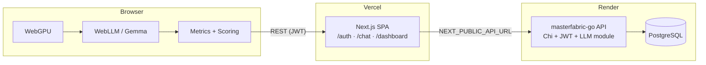

# API Reference

## Architecture

**Flow:** User authenticates on the Next.js SPA → loads a model in-browser (WebGPU) → streams chat with live metrics → scores computed client-side → sessions/messages/scores saved to Render Postgres via the Go API → dashboard reads aggregated history.

---

## 20 endpoints (`/api/v1`)

All JSON responses (except `/healthz`) use the envelope: `{ "data": …, "error": null }`.

| # | Group | Method | Path | Auth | Description |
|---|-------|--------|------|------|-------------|
| 1 | Config | GET | `/config` | Public | App config, feature flags, scoring weights/thresholds |
| 2 | Config | GET | `/config/models` | Public | Supported WebLLM model list |
| 3 | Auth | POST | `/auth/register` | Public | Register (email + password, bcrypt) |
| 4 | Auth | POST | `/auth/login` | Public | Login → access + refresh tokens |
| 5 | Auth | POST | `/auth/refresh` | Public | Rotate refresh token → new access + refresh tokens |
| 6 | Auth | POST | `/auth/logout` | Public | Revoke refresh token |
| 7 | Auth | GET | `/auth/me` | **JWT** | Current user profile |
| 8 | Auth | PUT | `/auth/me` | **JWT** | Update profile |
| 9 | Auth | POST | `/auth/change-password` | **JWT** | Change password |
| 10 | Auth | DELETE | `/auth/me` | **JWT** | Delete account |
| 11 | LLM | POST | `/llm/sessions` | **JWT** | Create chat session (model, device, load time) |
| 12 | LLM | GET | `/llm/sessions?page=&limit=` | **JWT** | Paginated session list (newest first) |
| 13 | LLM | GET | `/llm/sessions/:id` | **JWT** | Session detail (messages + scores) |
| 14 | LLM | DELETE | `/llm/sessions/:id` | **JWT** | Delete session (cascade) |
| 15 | LLM | POST | `/llm/sessions/:id/messages` | **JWT** | Save message + raw metrics |
| 16 | LLM | POST | `/llm/sessions/:id/scores` | **JWT** | Save decision scores for a message |
| 17 | LLM | GET | `/llm/metrics/summary` | **JWT** | Avg TTFT, avg tok/s, total tokens, session count |
| 18 | LLM | GET | `/llm/scores/summary` | **JWT** | Avg composite, accept/review/reject counts |
| 19 | CMN | GET | `/healthz` | Public | Health check (Render probe; no DB) |
| 20 | CMN | GET | `/version` | Public | Build version + git commit |

**Total:** Config 2 + Auth 8 + LLM 8 + CMN 2 = **20 endpoints**.

---

## Metrics & scoring methodology

### Raw metrics (client-side, during inference)

| Metric | Source |
|--------|--------|
| TTFT (ms) | Request start → first streamed token |
| Tokens/sec | Completion tokens ÷ decode duration |
| Prompt / completion tokens | WebLLM usage or character estimate (~4 chars/token) |
| Total elapsed (ms) | Request start → stream end |
| Model load time (ms) | `CreateMLCEngine` init duration |
| Runtime stats | `engine.runtimeStatsText()` after completion |

### Decision scoring (`frontend/src/lib/scoring.ts`)

Rule-based, deterministic, 0–100 per dimension. Implemented in the browser; results POSTed to the backend.

**Composite (weighted average):**

| Dimension | Weight |
|-----------|--------|
| Latency | 0.4 |
| Length | 0.3 |
| Format | 0.3 |

**Decision thresholds:**

| Composite | Decision |
|-----------|----------|
| ≥ 70 | **accept** |
| ≥ 40 | **review** |
| < 40 | **reject** |

**Latency score** (average of TTFT + throughput sub-scores):

| TTFT | Score | Tokens/sec | Score |
|------|-------|------------|-------|
| ≤ 500 ms | 100 | ≥ 25 | 100 |
| ≤ 1000 ms | 85 | ≥ 15 | 85 |
| ≤ 2000 ms | 65 | ≥ 10 | 65 |
| ≤ 5000 ms | 40 | ≥ 5 | 40 |
| > 5000 ms | 15 | < 5 | 15 |

**Length score** — completion/prompt token ratio:

| Ratio | Score |
|-------|-------|
| 0.5 – 3.0 (ideal) | 100 |
| < 0.2 | 25 |
| < 0.5 | 60 |
| 3 – 6 | 70 |
| 6 – 12 | 45 |
| > 12 | 20 |

**Format score** — starts at 50; ends with sentence punctuation (+25) or truncated (−25); repetition via 4-gram analysis (+25 / +10 / −20).
