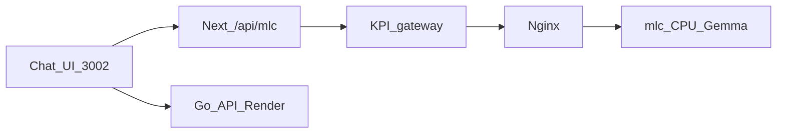

# Demo MUST Plan (permanent copy)

Go yok, MLC kalır. Inference is **MLC** only; the Go backend is **not** on the inference path.

## Decision lock

- **Inference:** MLC (Docker gateway → nginx → mlc). Ollama is out ([archive/ADR-001-ollama-rejected.md](../archive/ADR-001-ollama-rejected.md)).
- **Go backend:** untouched for inference. Auth / sessions / scores stay on Render as today.
- **No** image rebuild, tunnel, or real LoRA weights.
- **Chat path:** `Browser → /api/mlc → gateway:8080 → nginx → MLC`



**Jury sentence:** Go is not on the inference path — it handles auth, sessions, and scores on Render; live inference KPIs come from the MLC gateway (and Grafana). MCP exists in code; live measurement is gateway/Grafana.

## Why this plan

Chat already has a single-request lock (`isStreaming`). Gaps were wrong `.env.local`, missing gateway queue/prewarm, Ollama leftovers, and no demo-up script. Gateway already SSE-proxies; work is harden + queue + ready, not “build streaming from scratch.”

## MUST work (scope of the full plan)

1. **Hygiene** — `frontend/.env.local` → MLC `:8080` / `/app/model`; Ollama files → `archive/` + ADR.
2. **Streaming L1** — nginx buffering off; Next `/api/mlc` pass-through; `curl -N` + Chat first token.
3. **Gateway L2** — `MAX_INFLIGHT` queue, prewarm/`ready`, light LRU cache (owned by gateway agent).
4. **Compose L0** — threads + `shm_size`; Chat always `--scale mlc=1` (owned by compose agent).
5. **Scripts** — `scripts/demo-up.ps1`, `scripts/demo-down.ps1`.
6. **This doc** — permanent MUST summary.

## WON'T (conscious exclusions)

| Topic | Why |
|--------|-----|
| Go `HandleMCPStream` / message endpoint SSE | Do not touch Go |
| Vulkan / Arc native MLC | SHOULD / timebox; separate sprint |
| Ollama | Rejected |
| Tunnel / Vercel live Chat | Abandoned (CPU TTFT > tunnel timeouts) |
| `mlc-server-spike` rebuild | Slow + image risk |
| Real LoRA weight | Phase 2 |

## 2. Streaming — ✅ ÇÖZÜLDÜ

**Sorun:** `route.ts` Next.js yanıtı tutuyordu → ilk token'ı bekliyordu (yanıt “hepsi birden” geliyor gibi görünüyordu).

**Çözüm:** Erken SSE flush (`: connected` / `: gateway-open`) + `export const dynamic = "force-dynamic"`. Upstream `body` doğrudan pipe; `await json()` / tam buffer yok.

**Sonuç:** Token'lar TTFT'den sonra parça parça akıyor. No 504. Warm ölçü: TTFT ~17 s, toplam ~47 s (`max_tokens=32`). Detay: [PERF_RESULTS.md](PERF_RESULTS.md).

## Smoke (Definition of Done)

- [✓] `/healthz` ready
- [✓] `/v1/models` assert geçti (`/app/model`)
- [✓] `curl -N` streaming → `data: {...}` satırları akıyor
- [✓] Chat / proxy "Hi" → token'lar parça parça, TTFT ~17 077 ms (warm), no 504
- [✓] Eşzamanlı 2. istek → gateway **kuyruk** (`event: queue`); UI **kilit** (`isStreaming`); hata yok
- [✓] Grafana dashboard açılıyor (HTTP 200)
- [✓] Cache HIT ~73 ms (`X-Cache: HIT`)
- [✓] Ollama artığı temizlendi ✓ ADR yazıldı

## Frontend env (demo)

```
NEXT_PUBLIC_API_URL=https://llm-monitoring-api.onrender.com/api/v1
MLC_UPSTREAM=http://127.0.0.1:8080
NEXT_PUBLIC_MLC_MODEL_ID=/app/model
```

(`.env.local` gitignore’da — kopyala-yapıştır lokal.)

## Quick start

```powershell
.\scripts\demo-up.ps1
cd frontend
npm run dev -- -p 3002
# Chat: http://localhost:3002/chat

.\scripts\demo-down.ps1
```

Demo Day: [DEMO_DAY_RUNBOOK.md](DEMO_DAY_RUNBOOK.md) · Ölçümler: [PERF_RESULTS.md](PERF_RESULTS.md)
