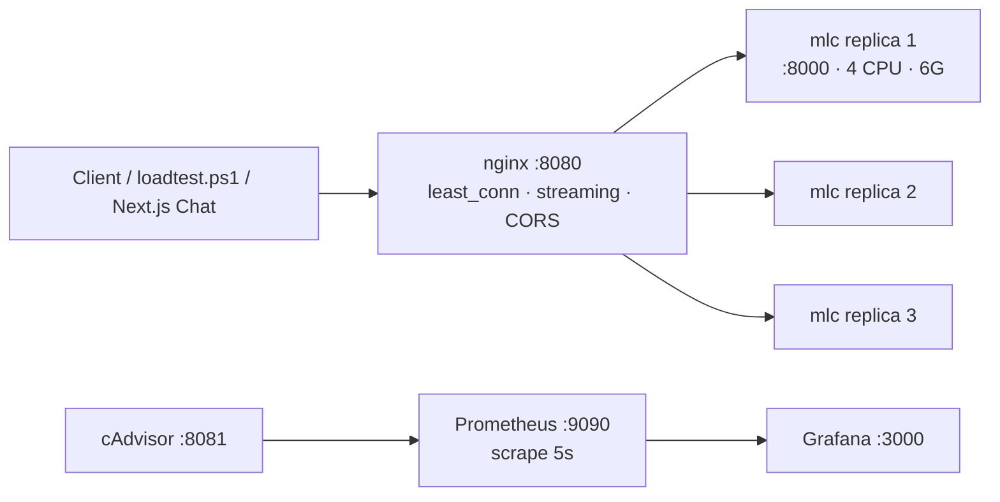

# MLC Scaling Report

CPU-only horizontal scaling for Gemma 2B via MLC-LLM, fronted by nginx `least_conn`, observed with Prometheus + cAdvisor + Grafana.

**Host:** 16 logical cores, Intel integrated graphics (no discrete GPU).  
**Image:** pre-built `mlc-server-spike` (~98 min first build — not rebuilt by compose).  
**Per-replica limits:** 4 CPU, 6G RAM (constant across scale).  
**Benchmark date:** 2026-07-24.

---

## 1. Executive Summary

Horizontal scaling **works** on this stack: nginx `least_conn` spreads concurrent chat completions across MLC replicas, and wall-clock throughput rises when going from 1 → 3 replicas.

| Metric | 1 replica | 3 replicas | Change |
|--------|-----------|------------|--------|
| Wall time (6 requests) | **1061.1 s** | **465.0 s** | **−56%** |
| Throughput | **0.005 req/s** | **0.013 req/s** | **+160% (~2.6×)** |
| Latency p50 | 155 s | 169 s | +9% (worse under contention) |
| Latency p95 | 165 s | 287 s | +74% (worse under contention) |

**Takeaways:**

1. **Throughput scales** — more replicas finish a fixed batch of work faster (~2.6× req/s with 3× replicas).
2. **Per-request latency does not improve** — and can worsen under concurrent load because replicas share a CPU-bound host (3 × 4 cores = 12 of 16 logical cores).
3. **Cold start is real but short** once the image exists — new replicas reached `healthy` in ~20–25 s (weights baked into the image).
4. **CPU ≠ GPU** — single-request generation stays on the order of **2–5 minutes** for `max_tokens=32` on this host; GPU deployments would target sub-second to few-second latency.

---

## 2. Architecture



| Component | Role |
|-----------|------|
| **nginx** | Single entry; Docker DNS + `least_conn`; `proxy_buffering off`; 300s timeouts; CORS for browser |
| **mlc** | OpenAI-compatible `/v1/chat/completions`; CPU Gemma 2B |
| **cAdvisor** | Per-container CPU / memory / network (**MLC has no `/metrics`**) |
| **Prometheus** | Scrapes cAdvisor every 5 s |
| **Grafana** | Dashboard `mlc-scaling-cadvisor` |

### MLC does not expose Prometheus metrics

Application-level TTFT / tokens-sec are **not** scraped from MLC. Container metrics come from cAdvisor. Chat UI computes TTFT / tokens-sec from the streamed OpenAI response.

---

## 3. Methodology

### Why load parameters were scaled down

Assignment-style **200 requests / 20 concurrent** is unrealistic on CPU:

- Measured generation ≈ **130–290 s** per request (`max_tokens=32`).
- 200 × ~150 s serial ≈ **8+ hours**; 20 concurrent would queue and 502 under nginx timeouts.

**Chosen suite:** `scripts/loadtest.ps1` with **6 total requests**, concurrency = replica count (1 or 3). Same prompt shape, `max_tokens=32`, via `http://localhost:8080`.

Raw outputs: [`evidence/loadtest-1replica.txt`](evidence/loadtest-1replica.txt), [`evidence/loadtest-3replica.txt`](evidence/loadtest-3replica.txt).

### Test setup

```powershell
docker compose up -d --scale mlc=1   # then loadtest -Total 6 -Concurrent 1
docker compose up -d --scale mlc=3   # wait healthy, then -Total 6 -Concurrent 3
```

Host: Windows + Docker Desktop WSL2, 16 logical cores, cpus=4.0 / mem=6G per replica.

---

## 4. Findings

### 4.1 One-replica benchmark

| Metric | Value |
|--------|-------|
| Total wall time | **1061.1 s** |
| Successful | 5 / 6 (1× **504** — nginx `proxy_read_timeout` 300s edge case) |
| Throughput | **0.005 req/s** |
| Latency avg | **151499 ms** (~151.5 s) |
| Latency p50 | **155089 ms** |
| Latency p95 | **164528 ms** |

### 4.2 Three-replica benchmark

| Metric | Value |
|--------|-------|
| Total wall time | **465.0 s** |
| Successful | **6 / 6** |
| Throughput | **0.013 req/s** |
| Latency avg | **206674 ms** (~206.7 s) |
| Latency p50 | **169339 ms** |
| Latency p95 | **286552 ms** |

### 4.3 Delta table

| Metric | 1 → 3 | Interpretation |
|--------|-------|----------------|
| Wall time | **−56%** | Batch finishes sooner |
| Throughput | **+160% (2.6×)** | Near-linear concurrent capacity |
| p50 latency | **+9%** | Shared CPU contention |
| p95 latency | **+74%** | Tail hurt when 3 replicas generate at once |

Load balancing (3 concurrent → 3 distinct upstreams), from nginx logs during the 3-replica run:

```
upstream=172.18.0.8:8000  request_time=283.877
upstream=172.18.0.7:8000  request_time=286.272
upstream=172.18.0.2:8000  request_time=168.600
```

Earlier proof file: [`evidence/nginx-access-1vs3.log`](evidence/nginx-access-1vs3.log).

### 4.4 Cold start

Scaling `mlc=1` → `mlc=3` (2026-07-24). New containers: `health: starting` → `healthy` in **~23 seconds** (weights already in image).

| Time | mlc-2 / mlc-3 |
|------|----------------|
| +5 s | health: starting |
| +11 s | health: starting |
| +17 s | health: starting |
| +23 s | **healthy** |

Full poll log: [`evidence/cold-start-scale3.txt`](evidence/cold-start-scale3.txt).

Until healthy, nginx can return 502/503 — always wait for `docker compose ps` healthy before demos/load tests.

---

## 5. Limitations & Future Work

- **CPU bottleneck** — scaling adds parallel slots, not faster tokens.
- **No MLC Prometheus metrics** — need sidecar or nginx log exporters for TTFT histograms.
- **nginx 300s timeout** — one 504 on the 1-replica run; raise timeout or lower `max_tokens` for demos.
- **Port clash** — Grafana and Next.js both want `:3000`; API vs nginx both want `:8080` unless API uses `PORT=8081`.
- **Future:** GPU (`cu121`) images, better quantization/scheduling, streaming-first UX, optional Redis for multi-node LB state.

---

## 6. Conclusion

Horizontal scaling with **nginx `least_conn` + N MLC CPU replicas** is proven: **~2.6× throughput** and **~56% shorter** batch wall time from 1 → 3 replicas, with multi-IP `upstream_addr` evidence.

The remaining ceiling is **hardware**. For interactive product UX, prefer **GPU MLC** or keep **browser WebLLM** (`/spike`). Use this CPU stack for offline scaling demos, observability practice, and cost modeling without a GPU.

**GPU deployment recommendations:** NVIDIA Container Toolkit + `mlc-llm` CUDA wheels; keep nginx `least_conn` and Prometheus/cAdvisor; expect order-of-magnitude lower latency and higher tokens/sec per replica.

---

## Operations quick reference

```powershell
cd C:\Users\aysnu\llm-monitoring-app
docker compose up -d --scale mlc=3
.\scripts\loadtest.ps1 -Total 6 -Concurrent 3
docker compose logs nginx --no-color | Select-String "upstream="
docker compose down
```

| Service | URL |
|---------|-----|
| MLC via nginx | http://localhost:8080/v1/chat/completions |
| Prometheus targets | http://localhost:9090/targets |
| Grafana | http://localhost:3000 (admin / admin) |
| Dashboard | http://localhost:3000/d/mlc-scaling-cadvisor |
